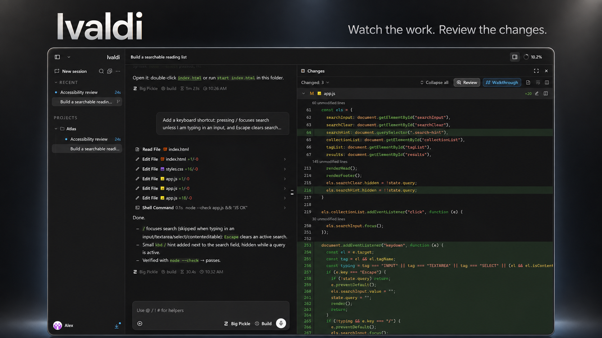
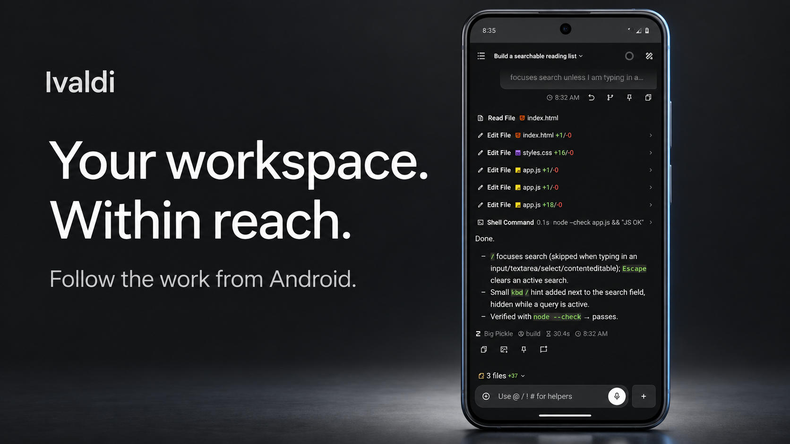

# Ivaldi



Ivaldi is a workspace for running AI agents, following their progress, and reviewing what they change. Powered by OpenCode, with a focused Work mode and a Developer mode for code, terminals, and Git.

[Download 1.20.1 preview](https://github.com/Dampish0/ivaldi-harness/releases/tag/v1.20.1-preview.1) · [Report a bug](https://github.com/Dampish0/ivaldi-harness/issues) · [Build from source](#build-from-source)

## Get Ivaldi

| Platform | Download | Requirements |
| --- | --- | --- |
| Windows | [x64 installer](https://github.com/Dampish0/ivaldi-harness/releases/download/v1.20.1-preview.1/Ivaldi-1.20.1-win-x64.exe) | Unsigned NSIS installer |
| Linux | [x64 AppImage](https://github.com/Dampish0/ivaldi-harness/releases/download/v1.20.1-preview.1/Ivaldi-1.20.1-linux-x86_64.AppImage) | FUSE 2, or extract and run |
| Android | [Updated release APK](https://github.com/Dampish0/ivaldi-harness/releases/download/v1.20.1-preview.2/Ivaldi-1.20.1-android.apk) | Android 7.0+, an Ivaldi server |
| VS Code | [VSIX extension](https://github.com/Dampish0/ivaldi-harness/releases/download/v1.20.1-preview.1/ivaldi-1.20.1.vsix) | VS Code 1.85+, OpenCode CLI |
| Web | [Run from source](#build-from-source) | Node.js 22+, Bun, OpenCode CLI |

This is a public preview. Windows and Linux bundle OpenCode 1.18.23. Desktop updates are installed manually. macOS, iOS, and ARM64 binaries are not included in this release.

The Windows installer is unsigned, so Windows may show an unknown-publisher warning. Verify downloads against the release's [SHA256SUMS.txt](https://github.com/Dampish0/ivaldi-harness/releases/download/v1.20.1-preview.1/SHA256SUMS.txt).

Android preview 2 includes the mobile UI redesign and uses the same release key as 1.20.1 preview 1, with version code 12002. It installs over that published APK. Use its [checksums](https://github.com/Dampish0/ivaldi-harness/releases/download/v1.20.1-preview.2/SHA256SUMS.txt) to verify the download. If you installed the earlier 1.20.0 APK, save any local connection details and uninstall it before installing this version. Your conversations remain on the server. Android push notifications are not configured in this preview.

## Follow the work, review the result

Keep projects and conversations together. Watch tool calls as they happen, inspect changed files beside the conversation, and use the terminal, browser, or file panel without leaving your session.

The screenshots show Atlas, a small reading-list app built by a real OpenCode session. The agent added keyboard shortcuts and ran a syntax check; the Changes panel shows the resulting diff.

[View the original desktop screenshot](docs/images/ivaldi-desktop-review.png)

## Choose how you work

- Switch between Work and Developer mode from your profile.
- Choose Manual, Auto, or Full access for agent permissions.
- Set bounded goals and follow progress, questions, and completion across projects.
- Compare model runs and combine useful results.
- Review diffs and walkthroughs, open files, and inspect Git changes.
- Connect GitHub, use tools and skills, and schedule prompts for recurring work.

## Take the workspace with you



The Android companion connects to your Ivaldi server. Read conversations, follow changes, and send follow-up prompts from your phone. OpenCode runs on the server, not on the phone.

Use HTTPS and a UI password for remote connections. The preview was checked on an Android emulator over an ADB loopback connection; physical devices, remote HTTPS, and QR pairing still need release testing.

[View the original Android screenshot](docs/images/ivaldi-android-session.png)

## Install

On Windows, run the downloaded installer. On Linux:

```bash
chmod +x Ivaldi-1.20.1-linux-x86_64.AppImage
./Ivaldi-1.20.1-linux-x86_64.AppImage
```

If FUSE is unavailable, extract the AppImage with `--appimage-extract` and run `AppRun` from the extracted directory with `APPDIR` set to that directory's absolute path.

For VS Code, open Extensions, choose **Install from VSIX**, select the download, and reload. The extension ID is `dampish0.ivaldi`.

## Build from source

Install Node.js 22 or newer, the Bun version declared in `package.json`, and the [OpenCode CLI](https://opencode.ai).

```bash
git clone https://github.com/Dampish0/ivaldi-harness.git
cd ivaldi-harness
bun install --frozen-lockfile
bun run build:web
node packages/web/bin/cli.js serve --ui-password choose-a-password
```

Ivaldi listens on localhost by default. To connect from another device on a trusted network, use `--lan` and set a UI password.

For development, run `bun run dev`. Native desktop builds use `bun run electron:build` on the target operating system. See the [desktop guide](packages/electron/README.md), [mobile guide](packages/mobile/README.md), and [contributing guide](CONTRIBUTING.md).

## Release status

Builds and publishing are manual. There are no GitHub Actions workflows. The preview includes fresh Windows, Linux, Android, and VS Code packages; see the release verification record for exact checks and remaining limits. Successful startup does not establish stable-release readiness or validate every provider, permission, recovery, and upgrade journey.

[Release readiness](docs/RELEASE_READINESS.md) · [Security policy](SECURITY.md) · [Future journeys](futureJourneys.md) · [Documentation](packages/docs/content/docs/index.mdx)

## Repository layout

| Package | Purpose |
| --- | --- |
| `packages/ui` | Shared React interface and state |
| `packages/web` | Web app, server, CLI, and OpenCode lifecycle |
| `packages/electron` | Native desktop shell |
| `packages/vscode` | VS Code extension |
| `packages/mobile` | Capacitor Android and iOS projects |
| `packages/docs` | Product documentation |

New installations store Ivaldi data in `~/.config/ivaldi`. Legacy data directories can be reused for compatibility.

## Origins and license

Ivaldi is an independent project. It includes MIT-licensed work by OpenChamber contributors and uses OpenCode as its agent runtime. Ivaldi is not affiliated with either project.

Licensed under the [MIT License](LICENSE). Original copyright notices are retained. [Image sources and prompts](docs/images/README.md).
