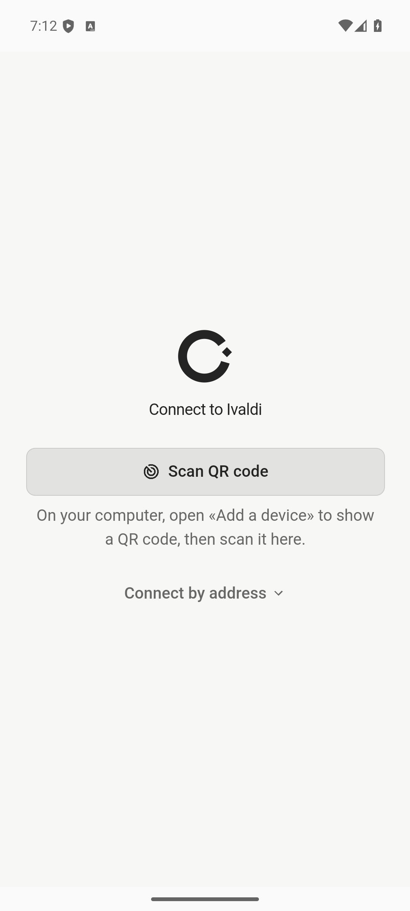
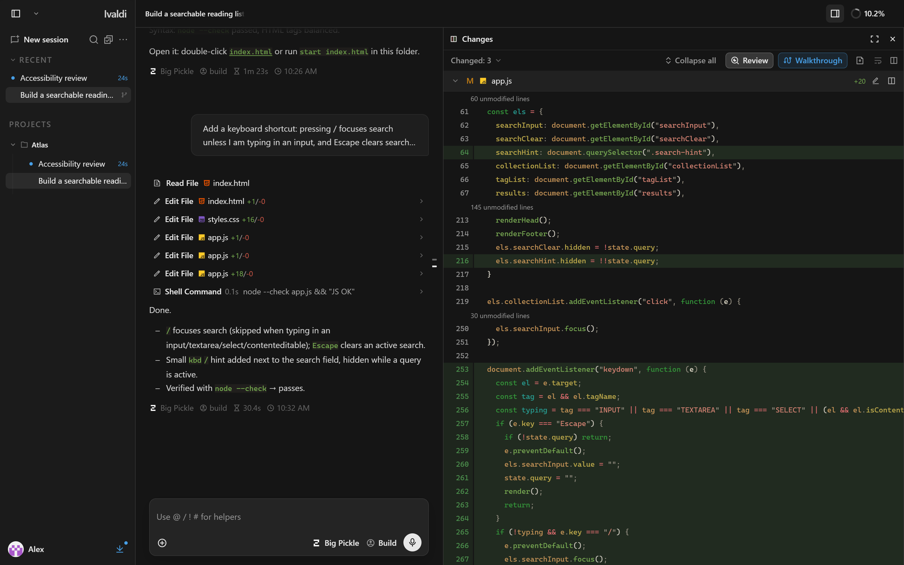
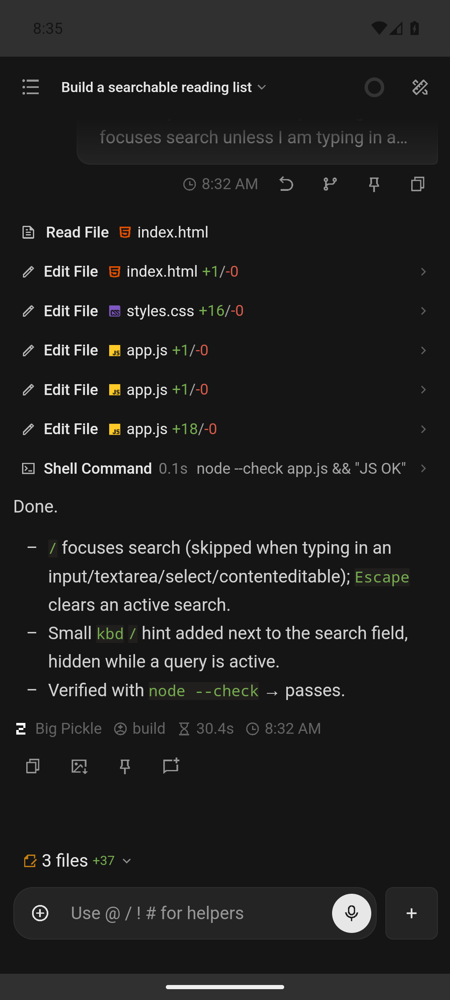

# Why the installed Ivaldi mobile app feels worse than desktop

This is the first assessment. The later [device audit and redesign](MOBILE_UX_REDESIGN.md) supersedes its header, composer, typography, and model-picker recommendations and records physical Android verification.

## Implementation update, September 12, 2026

The assessment below records the original problems. The mobile UI now includes:

- A persistent, labeled Work/Developer switch in the header, using desktop's product-mode store. The duplicate header session switcher is removed. The title shows the active chat and its closest registered project.
- The full composer in Work, with the same permanent-control policy as desktop. Developer keeps the compact composer. New chat is labeled in the chats drawer and no longer competes with attachments beside the prompt.
- Labeled workspace tabs and 44px targets for header, composer, and modal actions. Work exposes Files, Notes, and MCP. Developer adds Changes and Terminal.
- Project-scoped file navigation, cancellation of late listing/search results, and separate search failure and empty states with Retry. Changes resets its open diff when the project changes.
- Nested Android Back handlers for Files, Changes, and compact Settings, plus shared focus trapping, Escape handling, scroll locking, and focus restoration for mobile modals.
- The desktop image comparison component in mobile Changes, with original and modified images stacked vertically.

Validation completed on this implementation:

- Workspace type-check and lint passed. UI checks were repeated after the final UI edits. Oxlint passed on new and substantially rewritten files.
- 32 focused tests passed across mobile navigation, modal focus, connection storage, product-mode rules, Settings reachability, and locale key parity.
- Browser checks covered the dedicated mobile interface at 320, 390, and 768px widths in the dark theme. These verified mode selection, a draft surviving both modes, labeled Work tabs, project changes while a nested folder was retained, Settings detail navigation, and measured 44px header/composer buttons. No messages were sent.
- The web/mobile asset build, Android asset sync, and `assembleDebug` passed. The APK entry document matches the prepared mobile build. Build output still includes KaTeX font-resolution and large-chunk warnings.
- Dead-code analysis reported the existing unused-file/export/type backlog. It did not flag the new mobile modules or the shared image viewer.

The output is an Android debug APK, not a signed release update. No device was connected, and release signing credentials were unavailable. Native keyboard/IME behavior, real Android Back dispatch, physical touch and screen-reader behavior, iOS, push delivery, background/resume, remote-network recovery, and latency/battery behavior remain unverified. File-search failure handling and image rendering were reviewed in code but were not exercised against a failing server or an image-change fixture in the browser. This change does not configure Firebase or replace the connection lifecycle. Those parts of the assessment remain open.

## Original assessment

The central problem is an inconsistent product philosophy. Mobile exposes too many competing controls and destinations, obscures which ones matter, and gives no clear way to choose between Work and Developer mode. It shares desktop components, but it does not consistently preserve desktop's hierarchy, progressive disclosure, or distinction between ordinary work and developer operations.

The mode problem has a concrete cause. Fresh local state defaults to Developer. Desktop exposes mode selection through its sidebar menu and profile editor. The dedicated mobile shell replaces those components and does not expose an equivalent mode selector in the paths inspected. Mobile reacts to mode state without giving the person the corresponding choice.[^22][^23]

Connection problems, keyboard behavior, missing push, and file-browser defects compound this weak foundation. They remain important, but fixing them alone would leave a cluttered app whose rules differ from desktop. The primary product task is to make the same Work and Developer experiences coherent on a phone.

This assessment concerns the installed Capacitor app, with Android as the current distributed mobile product. It uses the local source and release records available on September 12, 2026. The repository identifies the Android release as 1.20.1 preview and explicitly excludes iOS from that release. iOS implementation risks are identified separately and must not be mistaken for observed Android defects.[^1]

## Evidence and limits

Three kinds of evidence appear below. **Confirmed implementation** means the behavior is explicit in source or release documentation. **Design judgment** explains the likely cost to someone using that behavior. **Needs device validation** identifies a plausible failure or performance problem whose frequency and severity have not been measured.

The visual evidence comes from existing original captures, including a signed Android APK on an Android 15 emulator and a desktop layout using production web assets. Promotional compositions are excluded. The captures show the same demo project, but they are not synchronized recordings of the same interaction.[^2]

No phone or emulator was connected during this assessment. There are no new measurements of frame rate, typing latency, battery use, missed notifications, or reconnect duration. Existing release tests establish Android installation, a working conversation, and restart persistence. They do not establish physical-device quality or reliable use away from the computer.[^3]

## Ranked findings

Priority here reflects the value of correcting the problem, not a claim about how often it occurs.

| Priority | Finding | Evidence | Main consequence |
| --- | --- | --- | --- |
| Product foundation | Mobile does not consistently apply desktop's hierarchy and progressive disclosure | Documented product principles and implementation comparison | Too many destinations and controls compete without a clear order of importance |
| Product foundation | No equivalent Work/Developer switch in the dedicated mobile shell; fresh state defaults to Developer | Confirmed source paths | The person receives developer complexity without an obvious choice of experience |
| First | Android preview has no configured push | Confirmed release limitation | The phone cannot reliably serve as the device that tells you to return to the work |
| First | File browser retains another project's directory | Confirmed source path, device reproduction pending | The apparent workspace can disagree with the files being browsed |
| First | Failed file search displays an empty result | Confirmed source path | Connectivity trouble looks like missing files |
| First | Android Back ignores nested routes | Confirmed source path, native reproduction pending | Familiar navigation abruptly leaves the current task |
| Next | Connection recovery can replace the workspace | Confirmed implementation, experience depends on network | Returning to a task becomes a connection-management task |
| Next | Phone navigation hides context and tool destinations | Confirmed layout, design judgment | Repeated discovery and switching costs |
| Next | Touch sizing prioritizes density | Confirmed CSS, device geometry pending | Small controls demand precision from a thumb |
| Next | Review loses useful desktop capabilities | Confirmed renderer differences | Inspecting results requires more navigation and offers less information |
| Next | Drawers lack consistent focus management | Confirmed implementation gap, assistive-technology validation pending | Keyboard and accessibility navigation may escape the visible task |
| Measure | Hidden workspace panes can still request data | Confirmed execution paths, cost unmeasured | Avoidable network and processing work may continue after dismissal |
| Measure | Composer depends on fragile platform coordination | Confirmed architecture, current latency unmeasured | Typing quality depends on transitions absent from desktop |
| Release gate | Mobile validation misses the defining mobile journeys | Confirmed evidence gap | Regressions can survive checks that prove only startup and basic operation |

## 1. Mobile needs to follow the same product rules as desktop

The repository already describes the intended rules. Work mode should present normal work concepts, keep the composer dominant, reveal advanced options when needed, and preserve the agent's full capability. Developer mode should retain the technical controls and observability needed for coding. The composer documentation makes that distinction concrete: Work keeps attachment, model, thinking, and a single primary action, while other operator controls appear contextually.[^24][^19]

These are product principles, not a requirement to squeeze desktop's columns onto a phone. They should still determine what appears first, how actions are named, and what the person has to understand before sending a prompt.

| Product rule | Desktop reference | Mobile divergence | Required direction |
| --- | --- | --- | --- |
| Choose the experience deliberately | Sidebar mode menu and profile editor expose Work and Developer | Dedicated shell lacks the equivalent selection path | Expose the current mode and a direct, named choice |
| Keep the task and composer primary | Work composer keeps a defined set of controls; technical detail is contextual | Header pickers, two drawers, a morphing composer, and separate new-chat access create competing interaction patterns | Give each common task one obvious route and remove redundant permanent controls |
| Keep essential context understandable | Project/session structure remains visible beside the conversation | The header omits project metadata and opens a second session-selection view | Preserve workspace identity without creating another permanent toolbar |
| Disclose capability when relevant | Work rules distinguish everyday actions from advanced configuration | Work still uses the mobile workspace's fixed Files / Notes / MCP tab structure, with text only on the active tab | Organize around the current task and use readable labels where discovery matters |
| Adapt layout without changing meaning | Mode, project, model, agent, and permissions are different concepts | Mobile hides mode choice while retaining other technical choices | Keep the same names, grouping, and conceptual boundaries across devices |

The complaint that there is "too much going on" is about competition for attention. Making every icon smaller does not resolve it. Hiding labels makes the competition harder to interpret. Moving the same collection into more drawers changes where the complexity lives without deciding which parts should be prominent.

The corrective design should start with the desktop Work and Developer rules, then decide what the phone must show at rest, what appears during a task, and what belongs in configuration. Every persistent control should justify its place. Adding a new navigation bar or another menu should require evidence that it replaces complexity rather than joining it.

MCP, Plugins, and Skills remain legitimate Work capabilities under the existing product principles. Their availability is not the defect. The issue is how their management competes with reading, writing, reviewing a result, and returning to a chat.[^24]

## 2. Work and Developer exist in state, but mobile does not offer the same choice

`DEFAULT_PRODUCT_MODE` is `developer`. `useProductModeStore` persists the selected value under `ivaldi-product-mode`. There is no mobile-specific Work default or initial mode selection in the dedicated connection flow inspected.[^22]

Desktop offers two explicit paths. Its sidebar menu contains a mode submenu with Work, Developer, and a checkmark for the current choice. Its profile editor renders `ProfileForm` with `showModeSelection`, exposing named mode choices when editing the profile.[^23]

Mobile renders its own header and sessions drawer instead of those sidebar components. Its drawer footer exposes the server instance and Settings. The header contains sessions, recent-session selection, metadata, and workspace access. Neither contains a mode selector. Shared Settings reads and filters by the product mode, but the inspected Settings path does not provide the missing selector.[^7][^16][^25]

This has three consequences. A fresh mobile installation starts with Developer presentation. The person cannot follow the desktop's familiar path to switch to Work. And a screen containing model, agent, or permission controls can give the impression that one of those is the mode selector, even though each changes something else.

The mobile Work branches do exist. They use Chats terminology, omit Changes and Terminal from the workspace, and skip some Git/worktree discovery. Their presence is evidence of partial adaptation. It does not make Work discoverable from the installed app.[^8][^24]

The mode control should be explicit, bidirectional, and available during ordinary use. Use the names Work and Developer, show the current selection, and explain each in one short sentence. Keep it in the same conceptual location as desktop, such as a shared profile or app menu, with a visible mode indication in that entry. Avoid creating a separate mobile name or an unlabeled icon for the same setting.

Proposed descriptions are "Work: focus on chats, files, and results" and "Developer: show code, Git, terminal, and execution details." These describe presentation. Switching mode must preserve the session and draft, and must not silently change the selected model, agent capability, or permission policy. The phone can rearrange the layout while keeping these rules identical to desktop.

The initial mode also needs a deliberate policy shared with desktop. A visible first-use choice or a clearly explained default is reasonable. Silently inheriting Developer from a storage default, while omitting the switch, is not a usable product decision.

## 3. The installed app does not remove the computer from the workflow

Desktop starts the Ivaldi backend in its own Electron process and distributes a bundled OpenCode runtime. Mobile bundles the interface and connects to an existing Ivaldi server. The phone does not contain the server or run the agent locally.[^4]

That architecture is reasonable for a remote companion. Its cost is still real. Before the phone can help, someone must have a working server, a reachable route to it, and any required authentication. The initial connection screen asks the person to open "Add a device" on the computer and scan a QR code, or connect by address. Installing the app is only one part of getting started.

The first-launch experience therefore sets a demanding expectation. The app needs to make pairing almost effortless and subsequent reconnection nearly invisible. If it fails at either, the user keeps paying for the architecture whenever they leave the computer or change networks.

The release evidence does not yet cover this promise. The current README says physical devices, remote HTTPS, and QR pairing still need release testing. An emulator reaching the server over ADB loopback proves the app can communicate through that route. It does not prove the route a person actually uses while away from home.[^1][^3]

The improvement is to make a saved computer feel like a durable connection. Preserve its identity, explain whether it is offline or needs authentication, and show the last useful workspace while recovery proceeds. Keeping the remote architecture is compatible with a much better experience.

## 4. Missing push undermines the strongest reason to install it

The current Android preview explicitly has no configured push notifications. The mobile README explains that Android can build and run without Firebase configuration, but push registration is then unavailable.[^1][^4]

This is a major product gap. A useful agent companion should allow a person to leave the computer and return when something needs attention. Without working push, they must repeatedly open the app to discover what happened. The phone becomes another place to check manually.

The implementation makes this dependency sharper. Native rendering replaces the shared notification API with a no-op. The intended background delivery route is native push. The push registration hook requests permission and registers a device token, but several failure paths return silently or write to the console. Registration failure is not surfaced as an actionable user-facing error by this hook.[^5]

This does not prove that every kind of in-app activity indication disappears. It establishes that the native background-notification route is a critical dependency, and that the distributed Android preview does not configure it.

A release should verify the complete journey on a physical device. Start work, background the app, receive the event, tap the notification, and return to the correct session. Include denied permission and registration failure. The interface should say whether notifications are ready, denied, or unavailable instead of letting a notification preference imply successful delivery.

## 5. Reconnection can turn continuity into another onboarding experience

The code contains real protections against flicker and premature disconnection. Transient reconnection keeps the mobile shell mounted. Resume checks can switch between available transports. Unreachable probes get retries rather than immediate teardown.[^6]

The remaining behavior is still disruptive. A cold-launch unreachable verdict clears the active endpoint and shows the connection screen, then retries in the background. Resume failure can also eventually clear the endpoint. The user can therefore move from "I was working here" to "connect to Ivaldi" because a server or network is temporarily unavailable.[^6]

There are also several distinct waits. Initial connection recovery text appears after a configured four-second timer. Last-session restoration can cover the already-mounted shell with a logo overlay, with a six-second safety timeout. Resume retries use sequential four- and ten-second delays plus the probes themselves. These are configured waits on different paths. They are not a measured total startup time and should not be added together.[^6]

The product problem is uncertainty. A logo cannot explain whether the app is restoring a conversation, looking for the computer, renewing authentication, or waiting for a server. Reusing the connection screen for an unavailable saved instance also makes temporary failure look more like lost setup than it needs to.

Keep saved-instance recovery distinct from first-time pairing. Show the last known session with explicit stale status where the data is available. Disable actions that require a live server and provide a visible retry or instance switch. That preserves context without pretending an offline view is authoritative.

## 6. The phone hides the structure that makes desktop understandable

The desktop capture exposes the session list, conversation, and Changes panel together. The person can compare the agent's claim with its edits while retaining a visible project and session location.[^2]

The phone dedicates the screen to chat. Sessions live in a full-cover left drawer. Workspace tools live in a full-cover right drawer. The header also contains a title that opens another session switcher and a separate metadata control. The header intentionally omits a project or branch metadata line.[^7]

Those choices create several nearby destinations with different meanings. The list icon opens the session tree, the title opens recent sessions, the metadata control opens session information, and the ruler icon opens workspace tools. Accessible labels help assistive technology, but they do not make these distinctions visible to someone looking at the screen for the first time.

Inside the workspace, only the selected tab displays its text label. In Developer mode, Changes, Files, Terminal, Notes, and MCP share that row. Unselected destinations become icon-recognition tasks.[^8]

A typical phone review journey is to read the response, open Changes through a shortcut or the workspace, inspect a file, close the drawer, reread the response, and repeat. Direct changed-file shortcuts reduce entry steps, but they do not preserve simultaneous access to the response and the review. The workspace preserves visited panes, so this is a context-switching cost rather than a claim that every reopen loses state.

Phones can preserve desktop's meaning within a different layout. Keep project identity understandable, give primary destinations readable labels, and provide a clear return target during review. Consolidate overlapping routes before introducing another navigation pattern. Any added summary or navigation control should replace an existing source of confusion and earn the screen space it uses.

Tablets deserve a separate judgment. The app already has a size-based tablet layout with a persistent session sidebar and, where room permits, a workspace side panel. The full-cover phone critique should not be applied wholesale to that layout.[^4][^7]

## 7. The file browser can show the wrong project's files

This is the strongest correctness finding in the UI review.

`MobileFilesSurface` initializes a local browser route from the effective project directory. When that root changes, its effect preserves any existing browser route with a nonempty directory. It does not check whether that directory belongs to the new root. The workspace keeps the Files component mounted after it has been visited, and an ordinary session switch does not key that component by project.[^8][^9]

The resulting source-level reproduction is straightforward:

1. Open Files while a session in project A is selected.
2. Leave the file browser at A's root or a subdirectory.
3. Close the workspace and select a session in project B on the same server.
4. Reopen Files.

The effective root now resolves to B, but the retained browser route still points to A. Listing and searching use the route directory. Opening a file uses the new root as the tab-store key while passing the selected path from that retained listing.[^9]

This is more serious than a confusing label. It weakens the person's ability to trust which workspace they are inspecting. It also gives a misleading impression that files failed to update. No destructive action or cross-project file write was reproduced, so this report does not claim data loss.

The rule should be explicit. Preserve navigation only within the same runtime and project identity. On a project change, restore that project's own route or reset to its root, and reject stale asynchronous results. Check both directions of the transition and use two projects with overlapping filenames so an incorrect result cannot pass unnoticed.

## 8. File search hides the difference between failure and absence

The file search effect catches request failure by assigning an empty array to `searchResults`. Once `isSearching` clears, the results component renders the same empty state used for a successful search with zero matches. There is no search-error state in that path.[^9]

A person can therefore search for a file that exists, lose connectivity during the request, and receive what looks like a valid "nothing found" answer. The directory-listing path does distinguish errors, which makes the inconsistency particularly avoidable.

On desktop, a local backend can make this failure less visible during ordinary use. The mobile companion depends on a network route to another machine, so truthful error states matter more. Otherwise a connection problem turns into doubt about the project, the filename, or the app's search.

The search result limit is also fixed at 40 with no pagination in this component. That is a secondary limitation for broad queries, not proof that a particular wanted file is omitted. First fix error versus empty semantics, retain or label previous results during retries, and expose a retry action. Then make truncation explicit when the API can identify it.

## 9. Android Back does not follow the screen's own navigation

The native Back handler knows about an open plan, an app-level screen, the workspace drawer, and the sessions drawer. When none is open, it minimizes the app. It has no registration mechanism for nested file, diff, settings, or header-picker routes.[^10]

The file editor has its own on-screen back arrow that returns to the file browser. Android Back instead reaches the shell and closes the entire workspace. A per-file diff has the same mismatch. Inside a Settings page, the shell sees Settings as one open screen, so system Back closes that screen rather than following its internal navigation.

The header's session switcher and metadata popover keep their open state inside `MobileHeader`. The shell's Back handler does not see that state. With no shell-level screen open, the handler can choose app minimization while one of those popovers is open.[^7][^10]

These are code-derived behaviors that need native reproduction, especially with a software keyboard or another native layer active. The structural problem is clear even before that test. Several components own navigation, while only the shell decides what Back means.

Back should dismiss the topmost relevant layer and then pop the current nested route. The visible back arrow and Android Back should agree. This needs a small shared navigation or dismissal contract, not more unrelated booleans in the shell.

## 10. Touch density and ambiguous controls work against the phone

The mobile CSS sets a general 36-pixel minimum width and height for many buttons. Header buttons are commonly 40 pixels. A composer-specific rule goes further, forcing footer action buttons to a width of `1.5rem` and removing their minimum width.[^11]

These are declared CSS dimensions, not measured native hit regions. Native units and CSS pixels should not be equated without checking the installed WebView. Nevertheless, the sizing policy plainly favors density. Android recommends touch targets of at least 48 by 48 dp, and Apple recommends at least 44 by 44 points.[^12][^13]

The original Android capture illustrates the consequence of fitting desktop-style information into the phone. Tool rows, metadata, message actions, a changes indicator, attachment access, dictation, and new chat all compete for space. The attachment action and new-chat action both use plus imagery near the composer, despite having very different effects.[^2][^14]

This is a design judgment about hierarchy, not a claim that the screenshot proves every target is too small. The useful next check is to inspect actual hit rectangles on a device. Expand invisible hit areas where possible, separate nearby actions, and make "attach" and "new chat" easier to distinguish.

The keyboard itself also competes for space. The resting composer is a button-like pill that expands into the editor. This buys reading room, but moves model and other expanded controls out of the resting view. A person who frequently adjusts a prompt or configuration pays for the collapse-and-expand behavior repeatedly.[^14]

## 11. Review is a reduced workflow, not just a narrow layout

The mobile Changes detail uses an inline text diff with wrapping enabled and side-by-side display disabled. That is a sensible default for a phone. It also explicitly renders an unavailable state for image changes. Desktop's shared DiffView includes an original/modified image viewer.[^15]

This matters beyond developers. Someone asking an agent to change a logo or other image can inspect the result through desktop review but reaches a dead end in this mobile review path. File preview elsewhere may help, but it is not the same as comparing the change where it is listed.

Opening a file on mobile loads the full shared file editor inside a mobile wrapper. That preserves useful features such as saving, search, previews, and file tabs. It also creates stacked controls: the workspace tab bar, the file's back/title row, and the editor's own controls.[^9]

The product needs to distinguish quick review from full editing. Keep the editor available, but let the common review journey prioritize the changed content, its explanation, and a clear return to the conversation. Add image comparison to the mobile Changes path. Do not treat forced side-by-side text as the solution to a phone's limited width.

## 12. The drawers imitate modal behavior incompletely

Both the workspace drawer and the sessions drawer render a dialog with `aria-modal="true"`. Their open effects lock body scrolling and install an Escape handler. They do not move focus into the drawer, contain Tab navigation, or restore focus to the opener. The separate `MobileFullscreenSurface` does implement focus entry, Tab containment, and restoration.[^8][^16]

That inconsistency is a functional gap. A visual overlay can cover chat while keyboard focus remains on the underlying interface. A modal declaration alone does not implement focus management. Hardware-keyboard and screen-reader behavior needs explicit validation, especially on tablets where keyboard use is anticipated by the application.

The edge-swipe behavior also falls short of direct manipulation. It observes touch start and touch end, then decides whether to open a drawer. The drawer does not track the finger through this hook. Android uses an 80-pixel activation zone near each edge, wider than the 32-pixel default, to accommodate system Back gestures.[^17]

The wider zone may compete with horizontal gestures inside content, but the frequency of accidental openings is unmeasured. The defensible finding is that this is a threshold-triggered shortcut, not an interactive drawer gesture. It should be evaluated as such, with both system navigation modes and horizontally scrollable code blocks.

## 13. Keeping screens warm also keeps some work alive

The workspace intentionally retains visited panes to preserve state. That is useful. The implementation does not consistently separate state retention from active work.[^8]

Terminal receives `visible={open && effectiveTab === 'terminal'}`. Changes receives no equivalent visibility input. Its effects can refresh repository data on directory changes and schedule diff prefetching when the change list updates, including while the drawer is closed. A prefetch call requests up to 40 files. The MCP pane remains mounted and supplies a constant active flag; directory changes can therefore trigger its refresh effects while hidden.[^18]

These paths establish opportunities for unnecessary work. They do not establish repeated network transfers in every case, since downstream stores may deduplicate requests or satisfy them from caches. They also do not prove a battery drain, a memory leak, or the cause of reported sluggishness.

Measure the difference between a fresh chat and the same chat after visiting Changes and MCP, then closing the drawer. Use an identical stream of work and record requests, transferred bytes, scripting, layout, and frame times. Repeat across project switches. If hidden panes are responsible for material cost, preserve their state while suspending nonessential work.

A broad "rewrite it in native code" recommendation would skip this diagnosis. The evidence points first to activity ownership and visibility, not to a demonstrated limit of React or Capacitor.

## 14. Typing relies on platform-specific choreography that desktop does not need

The composer documentation is unusually candid. It describes corrections for keyboard dismissal before clicks arrive, gesture-bound programmatic focus, viewport panning, selection rendering, and transitions between overlays. It also says that rendering, focus, keyboard behavior, IME, and WKWebView are not covered by the current automated tests.[^19]

On iOS, the keyboard plugin uses resize mode `none`, and the app manually coordinates keyboard inset, shell layout, composer transforms, scroll padding, and caret visibility. The show path schedules a layout settle after 250 plus 20 milliseconds, then schedules caret restoration another 250 milliseconds later. That is a nominal 520-millisecond caret-hold path, not a measured typing delay. Android skips this inset choreography because its window resizes for the keyboard.[^20]

These workarounds have reasons. Deleting them because they look complicated could restore the problems they were added to prevent. Their existence shows how many interactions must agree for a basic mobile action to look stable.

For the currently distributed Android app, test the Android behavior directly. Do not use iOS comments about past input lag as proof of current Android lag. For any future iOS release, verify typing and selection on hardware before making quality claims.

The important journeys are more specific than "keyboard opens." Type a long draft, move the caret, select text, use composition input, open an attachment picker, cancel it, dismiss the keyboard, and resume typing. Repeat while a long conversation streams. Check that the first tap works, the draft survives, and the viewport stays where the person left it.

## Why these problems accumulate

The app has a dedicated mobile entry point and substantial mobile-specific work. Each part has solved a local constraint without consistently carrying through the shared product rules. Shared components have not been enough to preserve a shared experience.

The shell owns drawers. Files owns another route. Settings owns another navigation stage. Header popovers own their visibility. The keyboard changes the composer. Native lifecycle handling can replace the shell with connection UI. Each decision is understandable in isolation. Together they make continuity depend on transitions spread across many components.

Meanwhile, preserving desktop capability brings substantial configuration and review machinery onto the phone. The mobile settings allowlist contains 22 page identifiers, although product-mode and runtime filtering can reduce what is actually shown. The workspace mixes frequent reading and review with tools such as MCP administration.[^21]

The phone needs the same explicit Work/Developer choice and the same ordering of priorities as desktop. In Work, understanding the task, reading results, and sending a follow-up should dominate. Developer can expose technical inspection and control deliberately. Advanced configuration remains available without receiving equal prominence in every mode.

## What should change first

Start the product work by carrying desktop's Work and Developer rules into mobile. Add the missing mode-selection path and make the selected experience understandable. Define the small set of controls each mode shows at rest, remove redundant entry points, and reveal secondary controls only when the task calls for them. Use the same terminology and grouping as desktop.

Fix project-scoped file navigation, failed-search presentation, and Android Back as immediate correctness work. Those repairs are necessary, but they do not substitute for resolving the hierarchy and mode-choice problems.

Next, make the installed app useful when it is not open. Configure and verify Android push, surface delivery readiness, and make notification taps recover the correct session. Keep saved-instance recovery separate from onboarding and preserve useful context through a temporary disconnect.

Apply the shared product rules to the repeated phone journeys. Keep workspace identity understandable, label the main destinations, improve measured touch targets, and reduce nested chrome around review. Bring image comparison into the mobile Changes path where Developer review is available. Use one consistent focus and dismissal contract for overlays.

Performance work should follow measurement. Compare hidden-pane activity before and after visiting tools, and profile real typing and scroll interactions. The code review provides good hypotheses; it does not justify a cache layer, a framework rewrite, or a promise that any specific optimization will fix the experience.

## Acceptance journeys for a credible mobile release

The following are proposed release criteria, not tests that already passed.

| Journey | Required result |
| --- | --- |
| Choose Work or Developer on a fresh installation | The choice is discoverable without developer knowledge; the default and current mode are clear |
| Switch modes during a chat, then restart | Both directions work; selection persists; session and draft survive; model and permission policy do not change silently |
| Compare the same task in Work on desktop and phone | Primary actions, terminology, and progressive disclosure agree; phone-specific controls do not crowd out the task |
| Enter Developer mode | Git, terminal, and technical inspection become discoverable through a coherent developer layout |
| First connection on a physical Android phone | QR pairing and address entry both reach a usable workspace through supported real network routes |
| Return after backgrounding | Last session and draft remain available; temporary connection loss has an accurate, recoverable state |
| Switch between projects A and B | File browser, search, diff, and editor all match the selected project; stale requests cannot overwrite the new context |
| Search while the server is unreachable | A retryable failure appears; it is never presented as an authoritative empty result |
| Android Back from file, diff, Settings, and header picker | Only the current nested route or topmost overlay closes; the visible back action agrees |
| Background completion or request for attention | A notification arrives when appropriate and opens the intended session; denial and setup failure are visible |
| Type, select, paste, compose, and attach | No lost draft, extra activation tap, displaced caret, or unexplained scroll jump across supported keyboards |
| Inspect an image change | The changed image is reviewable from Changes without a dead-end unavailable screen |
| Navigate with keyboard and screen reader | Opening a modal moves focus into it; navigation stays inside it; closing restores focus |
| Leave visited tools closed during a long session | Profiling distinguishes useful retained state from unnecessary background processing and requests |
| Upgrade the distributed APK | Supported upgrades retain local state; any required reinstall is explained before users discover it themselves |

Run the critical journeys on the final signed artifact and record device, OS, keyboard, network route, project scale, and result. Include a midrange physical Android phone, not only the emulator. Treat iOS and tablets as additional validation targets when they are actually distributed. The existing 1.20.1 record is useful preview evidence, but its passing installation and restart checks do not answer these questions.[^3]

The primary failure is inconsistent product design. Mobile gives too many controls equal weight and lacks the desktop's accessible Work/Developer choice. Reliability defects make that worse. The redesign should carry through the same product philosophy, establish an explicit mode boundary, and remove competing UI before adding more.

## Sources

Repository sources below identify the implementation inspected for this assessment. Original screenshots are evidence of their recorded builds, not live captures of every source change.

[^1]: Ivaldi, [root README](../README.md), current preview scope, Android signing transition, unconfigured push, and remaining mobile release checks.
[^2]: Ivaldi, [image provenance](../docs/images/README.md), with [original desktop review capture](../docs/images/ivaldi-desktop-review.png) and [original Android session capture](../docs/images/ivaldi-android-session.png). The connection capture is an additional repository image; its exact capture conditions are not individually documented there.
[^3]: Ivaldi, [release readiness](../docs/RELEASE_READINESS.md), especially the September 12, 2026, 1.20.1 preview record. Earlier records are retained in the file and must not override later results.
[^4]: Ivaldi, [mobile README](../packages/mobile/README.md) and [Electron README](../packages/electron/README.md), runtime ownership, tablet layout, push configuration, and platform scope.
[^5]: Ivaldi, [native notification API override](../packages/ui/src/apps/renderMobileApp.tsx) and [native push registration hook](../packages/ui/src/apps/useNativePushRegistration.ts).
[^6]: Ivaldi, [resume probing and retry behavior](../packages/ui/src/apps/MobileApp.tsx), [cold-launch classification](../packages/ui/src/apps/MobileApp.tsx), [session-restore gate](../packages/ui/src/apps/MobileApp.tsx), and [connection rendering](../packages/ui/src/apps/MobileApp.tsx).
[^7]: Ivaldi, [mobile header](../packages/ui/src/apps/MobileHeader.tsx) and [phone shell layout](../packages/ui/src/apps/MobileApp.tsx).
[^8]: Ivaldi, [workspace drawer](../packages/ui/src/apps/MobileWorkspaceDrawer.tsx), visited-pane retention, selected-tab labels, visibility inputs, and modal handling.
[^9]: Ivaldi, [mobile file browser state and search](../packages/ui/src/apps/MobileFilesSurface.tsx), [editor wrapper](../packages/ui/src/apps/MobileFilesSurface.tsx), [empty search presentation](../packages/ui/src/apps/MobileFilesSurface.tsx), and [effective directory resolution](../packages/ui/src/hooks/useEffectiveDirectory.ts).
[^10]: Ivaldi, [shell Back handler](../packages/ui/src/apps/MobileApp.tsx), [native Back listener](../packages/ui/src/apps/mobileNativeChrome.ts), and [Settings internal back navigation](../packages/ui/src/components/views/SettingsView.tsx).
[^11]: Ivaldi, [mobile touch sizing](../packages/ui/src/styles/mobile.css), including the composer footer width override at line 60.
[^12]: Android Developers, [Make apps more accessible, Use large, simple controls](https://developer.android.com/guide/topics/ui/accessibility/views/apps-views), updated April 21, 2026, accessed September 12, 2026. Recommends at least 48 by 48 dp touch targets.
[^13]: Apple Developer, [UI Design Dos and Don'ts, Hit Targets](https://developer.apple.com/design/tips/), accessed September 12, 2026. Recommends at least 44 by 44 point controls.
[^14]: Ivaldi, [collapsed mobile composer](../packages/ui/src/components/chat/composer/ui/MobilePillComposer.tsx), attachment, expansion, primary action, and new-chat controls.
[^15]: Ivaldi, [mobile diff detail](../packages/ui/src/apps/MobileChangesSurface.tsx) and [desktop image diff renderer](../packages/ui/src/components/views/DiffView.tsx).
[^16]: Ivaldi, [sessions drawer modal implementation](../packages/ui/src/apps/MobileSessionsSheet.tsx) and [fullscreen modal implementation](../packages/ui/src/apps/MobileFullscreenSurface.tsx).
[^17]: Ivaldi, [edge swipe hook](../packages/ui/src/apps/useEdgeSwipe.ts), thresholds and passive touch start/end handlers.
[^18]: Ivaldi, [Changes refresh and prefetch effects](../packages/ui/src/apps/MobileChangesSurface.tsx), [MCP workspace active flag](../packages/ui/src/apps/MobileWorkspaceDrawer.tsx), and [MCP refresh effects](../packages/ui/src/components/mcp/McpDropdown.tsx).
[^19]: Ivaldi, [composer documentation](../packages/ui/src/components/chat/composer/DOCUMENTATION.md), especially Mobile and Testing, and [mobile composer lifecycle](../packages/ui/src/components/chat/composer/state/useMobileComposerShell.ts).
[^20]: Ivaldi, [Capacitor keyboard configuration](../packages/mobile/capacitor.config.ts), [Android keyboard branch](../packages/ui/src/apps/mobileNativeChrome.ts), and [iOS settle/caret timing](../packages/ui/src/apps/mobileNativeChrome.ts).
[^21]: Ivaldi, [mobile settings page allowlist](../packages/ui/src/apps/mobileSettingsPages.ts). This is an allowlist, not an assertion that every entry is visible in every mode.
[^22]: Ivaldi, [product mode default and shared rules](../packages/ui/src/lib/productMode.ts) and [persisted product mode store](../packages/ui/src/stores/useProductModeStore.ts). The fresh-state default is Developer; persisted installations can differ.
[^23]: Ivaldi, [desktop sidebar mode submenu](../packages/ui/src/components/session/sidebar/shell/SidebarHeader.tsx), [profile editor mode-selection host](../packages/ui/src/components/session/sidebar/shell/SidebarFooter.tsx), and [profile mode-selection form](../packages/ui/src/components/onboarding/ProfileSetup.tsx).
[^24]: Ivaldi, [Work mode product principles](../WORK_MODE_POLISH_PLAN.md), especially Product principles, Work composer, and the later implementation notes. The plan includes older proposals, so current composer documentation governs the primary-action behavior cited here. Its later mobile QA notes do not demonstrate a mode-selection control in the dedicated shell.
[^25]: Ivaldi, [mobile drawer footer](../packages/ui/src/apps/MobileSessionsSheet.tsx) and [Settings mode consumption](../packages/ui/src/components/views/SettingsView.tsx). Repository-wide inspection of product-mode setters and `ProfileForm` hosts found desktop paths but no equivalent dedicated mobile host.
