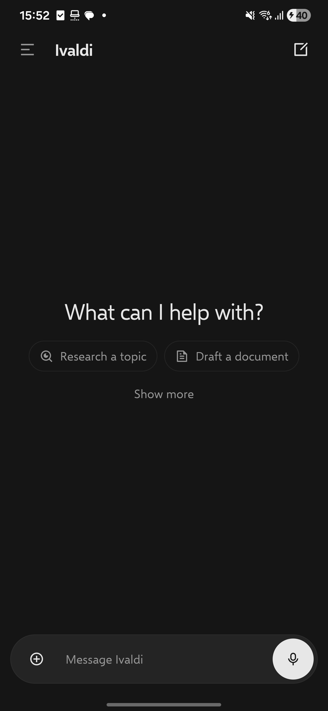
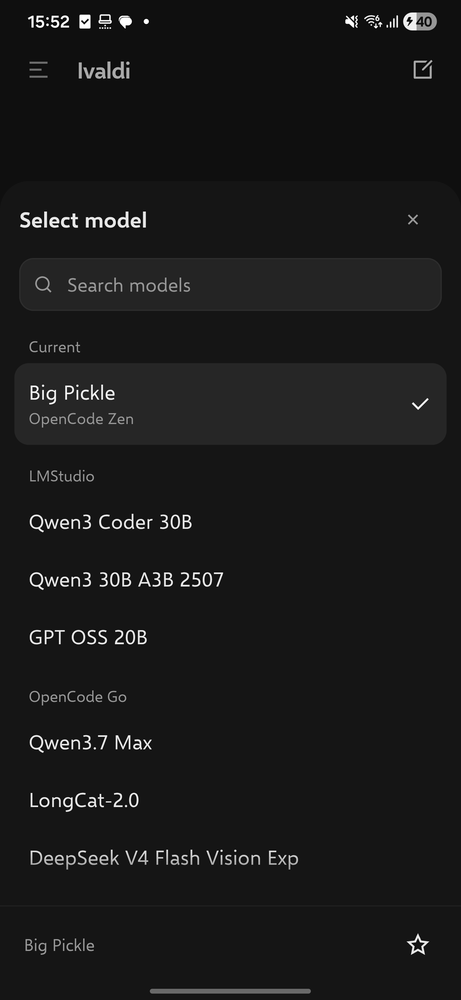
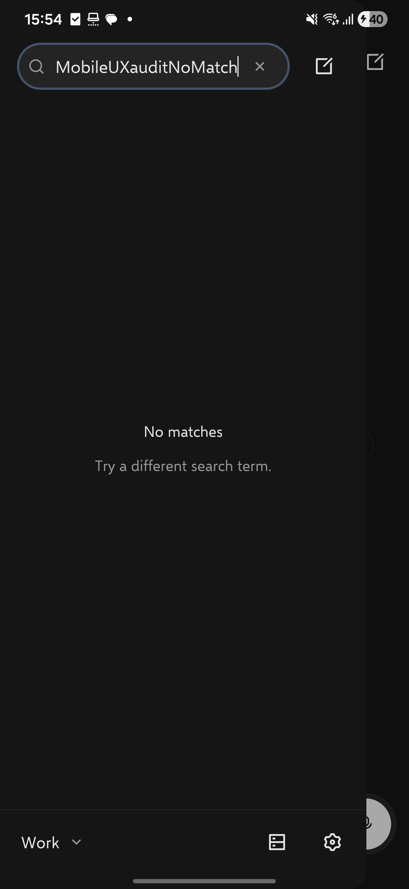
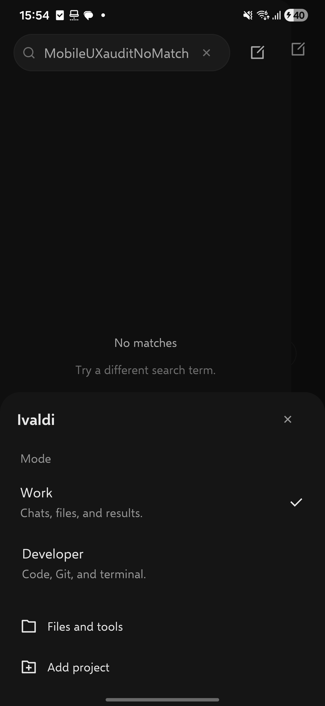
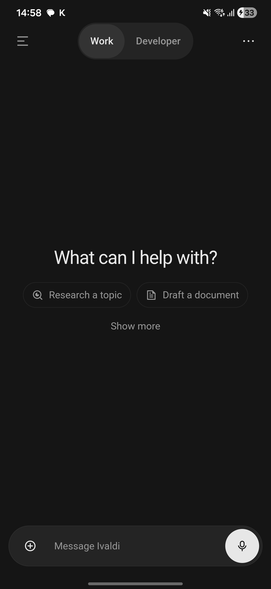
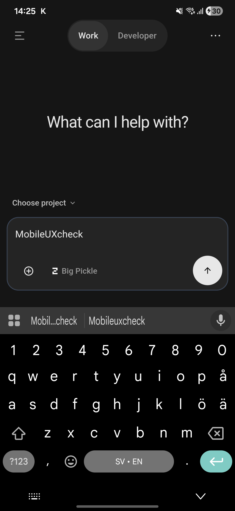
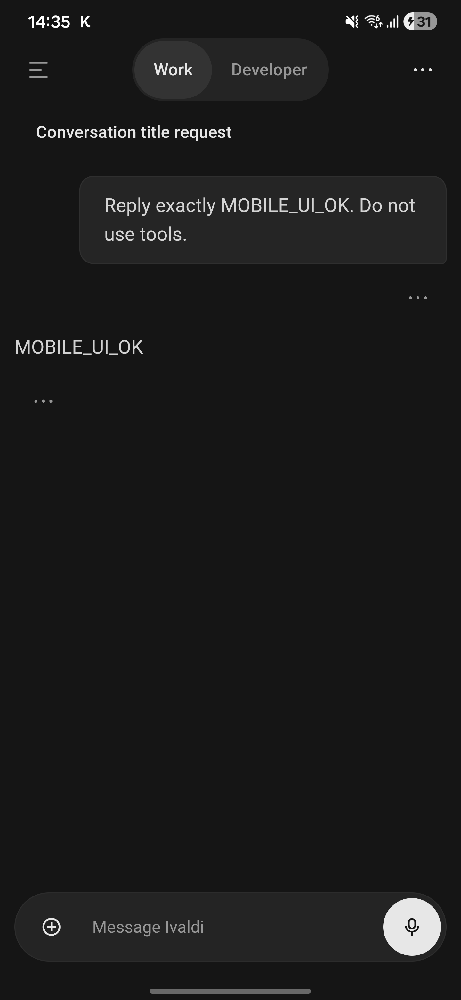

# Why Ivaldi mobile still feels wrong

Device audit and redesign specification, 12 September 2026.

## Revision after using the first redesign

The first implementation improved basic navigation but the user rejected its
visual design. The permanent Work/Developer control was an overcorrection.
Switching modes is infrequent, so it should be clear inside secondary navigation
without taking over the conversation header. The earlier acceptance criterion
requiring both labels in that header is superseded.

The second inspection identified these remaining causes:

- The declared desktop system-font stack renders Roboto on this Samsung phone,
  confirmed through the WebView's rendered-font report. It is a different
  typeface from the desktop. The user rejected Inter for this product, so it
  must not replace the current font. The user asked to match the Windows desktop
  as closely as practical. The revision bundles Microsoft's
  [Selawik](https://github.com/microsoft/Selawik), an open-source replacement for
  Segoe UI. It is not an exact copy of Segoe UI. Regular, semibold, and bold load
  from the installed app, without a font CDN. Existing font preferences remain
  valid, and the previously hidden mobile font setting is now available.
- The drawer header combines Close, Chats, a text-heavy New chat action, and a
  management menu above another search row. It needs a quiet search field and
  compact compose action, with mode and management below the conversation list.
- Model selection still resembles a settings table. Every row exposes favorites,
  thinking controls, dividers, and provider accordions. Work needs readable model
  choices, a clear selected mark, and secondary controls for the selected model.
- Sheets animate their whole height on entry and disappear immediately on close.
  Drawers use separate timing code, and these transitions ignore reduced motion.
  Opening and closing must use the same short motion vocabulary and complete
  their focus and Back lifecycles even if reversed quickly.
- Typography, row spacing, rounded corners, and icon weight need to be assessed
  together. Passing type checks does not establish that the app looks coherent.

The motion contract for this revision covers one history drawer, one workspace,
and nested composer sheets on the connected 384 by 832 CSS pixel viewport. Use
only transform and opacity, finish normal transitions within 220 milliseconds,
disable travel for reduced motion, and retain keyboard, focus, draft, and Back
ownership. This is a motion-design change; it does not claim a measured CPU or
streaming-performance improvement.

### Implemented revision

The conversation header now has Menu, the conversation title or Ivaldi, and a
compose icon. Developer also retains its workspace shortcut. The drawer opens
with search and an icon-only compose action. Its footer shows the current mode;
tapping that row opens the Work and Developer choices with descriptions. Files
and tools, project management, instances, and Settings remain reachable there.

Work history uses 16 pixel titles and omits historical timestamps. Live activity
still has its status. Work's model chooser starts with the current model and its
provider. Plain provider sections and favorites omit that model and any other
duplicates. Thinking and favorite
controls apply to the selected model in its footer. Search, provider identity,
selection policy, and unavailable-model recovery remain intact.

Sheets move 16 pixels over 180 milliseconds while fading. History and workspace
drawers use a 220 millisecond horizontal transition. Closing panels become inert
immediately and leave the DOM after the transition. Reopening cancels removal.
Reduced motion removes travel and the exit delay. Native Back and focus remain
owned by the current open panel.

### Revision device results

The revised Android debug APK was installed over the existing app on the same
Galaxy S24 Ultra. The connection survived both updates. The final APK is
40,043,838 bytes, version 1.20.1, version code 12001.

| Check | Observed result |
|---|---|
| Typeface | The WebView reports Selawik-Regular as the custom font rendering the home heading; the body uses the same family |
| Font settings | Appearance exposes Selawik and the other existing choices; the selection survives the final app update |
| Header | One row with 48 pixel action targets; no permanent mode switch |
| History navigation | Search and icon-only New chat work; mode is named in the footer |
| Mode change | Work to Developer and back preserves the synthetic draft |
| Model picker | Current model appears first, with provider and selected mark; it occurs once in the list |
| Search and selection | Searching Big Pickle finds it; choosing it restores editor focus and the 500 pixel keyboard-open viewport without changing the draft |
| Native Back | Closes the model sheet, closes a nested mode sheet before history, and dismisses the keyboard to restore the 832 pixel viewport |
| Workspace access | Work's footer menu opens Files, Notes, and MCP; Developer's header shortcut retains Changes and Terminal too |
| Motion | Normal sheet CSS uses the 180 millisecond transition; a WebView reduced-motion override changes its transition and transform to none |
| Layout | Document width remains 384 pixels in the inspected portrait states |

The temporary draft and search were cleared. The app was left in Work on an
empty draft. No conversation was sent during this revision. The history images
use an unmatched synthetic search so personal conversation titles are excluded.

The revision's focused suites pass 16 tests with 62 assertions. They exercise
real rendered sheets, nested Back and focus, interrupted closing transitions,
reduced motion, current-model ordering, favorite deduplication, provider-aware
selection, unavailable-model recovery, and mobile font settings search.
Workspace type checking and lint passed before the final model ordering change.
The final UI type check passed by running the package's TypeScript compiler with
Node after the Bun script runner crashed. The final focused ESLint and Oxlint
checks pass. The production web/mobile asset
build, Capacitor sync, Android Gradle build, and APK signature check pass.

The required dead-code scan retains the same existing two unused files, 222
exports, 163 exported types, and one duplicate. Neither new component nor the
presence hook appears in it. A broader Oxlint scan still reports the pre-existing
typing backlog in shared stores and large components; it is not a clean result.
No new rule suppression was added.

This revision was checked on Android in portrait. It does not establish iOS,
tablet, landscape, TalkBack, or large-font correctness. Thinking selection has
automated callback coverage, but the selected phone model has no thinking
variants. Frame timing, battery use, and streaming performance were not profiled.
The existing KaTeX URL, mixed-import, and large-chunk build warnings remain.

## Original audit and first implementation

The remaining sections record the initial diagnosis and first implementation.
The revision above supersedes their visible header mode switch and model-picker
presentation. Their earlier screenshots and checks are retained as history.

## Finding

The installed mobile app still presents a configuration interface before it presents a conversation. The desktop Work design already makes a different choice. It gives the prompt, the conversation, and the resulting work priority, while keeping operator controls available when needed. Mobile reuses some desktop components but changes their hierarchy, typography, navigation, and resting input. That is why fixing individual buttons did not make it feel like the same product.

This assessment was written before the redesign below was implemented. The earlier [mobile assessment](MOBILE_APP_ASSESSMENT.md) records the preceding pass. Its implementation improvements did not resolve the central design problem.

The evidence also includes a functional failure. Pressing Android Back with the model picker open minimized Ivaldi and left the picker open in the background. A familiar mobile appearance is insufficient if basic navigation contradicts the platform.

## What was inspected

The baseline is the installed Ivaldi Android debug app, version 1.20.1, on the connected Samsung Galaxy S24 Ultra. Its physical display is 1440 by 3120 pixels. The app's WebView reports a 384 by 832 CSS pixel viewport and a device pixel ratio of 3.75. Measurements below are CSS pixels, unless stated otherwise. Font scaling was 1.0.

The inspection covered the empty Work chat, the model picker, opening the keyboard, drawer controls, native Back, and source ownership of those interactions. The installed ChatGPT Android app was inspected directly on the same phone, including a blank Chat draft, a blank Work draft, and a running task. No reference conversation was sent. Personal suggestion text and conversation history are excluded from this report.

The desktop comparison uses the product contract in [the Work mode plan](../WORK_MODE_POLISH_PLAN.md), the shared composer, and the existing desktop design. It does not assume that every ChatGPT feature should be copied. Ivaldi has remote connections, project directories, developer tools, and its own execution model.

This is a device and code audit, not a user study. It establishes observable interaction failures and design inconsistencies. It does not establish population-wide usability scores, measured typing latency, iOS correctness, or battery performance.

## The screen budget is spent on the wrong things

The raw baseline captures remain local because their header includes a personal project label. The measurements below record the original layout.

At rest, the input region occupies roughly 196 pixels once the separate project row is included. The editor itself contains a single empty line. The actual composer box is about 153 pixels tall because text entry, model selection, and the action footer are three separate rows.

| Baseline element | Observed size or position | Consequence |
|---|---|---|
| Header including the native top inset | 86 pixels | Four competing controls occupy the first scan line |
| Empty-state heading | 26 pixel type, near y=233 | The heading has little visual separation from the enlarged supporting text |
| Capability paragraph | 16 pixel type over several lines | Product explanation consumes conversation space |
| Starter controls | Five actions and a customization control | The blank page asks the user to classify work before writing |
| Project selector | Separate 36 pixel row | Project setup reads as a prerequisite for a normal chat |
| Model selector | Separate row between text and footer | One setting increases the entire input's height |
| Composer action footer | 56 pixels | Large control spacing adds to the preceding rows |
| Keyboard-open viewport | 500 pixels high | The oversized input takes an even larger share of the usable screen |

With the keyboard open, the text editor begins near y=333 and the footer near y=415. The keyboard resize itself works on the inspected Android build. The problem in this state is how little useful space remains above the composer, rather than evidence that the keyboard is covering it.

The desktop can afford a centered welcome and a roomy input. A phone must adapt that composition to a single, narrow column. Android's adaptive layout guidance explicitly recommends one pane at compact sizes and adapting component presentation to available space.[^adaptive] Shrinking desktop controls without changing their grouping does not satisfy that requirement.

## Why the implementation produces this result

### 1. Work and Developer are still not a clear pair

`MobileHeader.tsx` renders the current mode as a dropdown. The other mode is invisible until the menu opens. It competes with the session title, a project subtitle, a left-panel icon, and a right-panel icon.

This is technically a switch, but it does not explain the product's two modes at a glance. The user specifically asked for a clear distinction. A visible two-choice control is the appropriate hierarchy here. Work and Developer should be adjacent, with the selected mode plainly marked. Changing mode must preserve the draft and the underlying agent capability.

The directly inspected ChatGPT phone interface demonstrates the relevant pattern with its centered Chat and Work choices. The transferable lesson is visibility of the available modes and a stable position for switching, not the exact wording or a copy of its product model.

### 2. The composer has become a toolbar stack

The earlier mobile change kept the complete Work editor visible while Developer retained the compact pill. In `ChatInput.tsx`, the collapsed presentation is explicitly gated on Developer mode. Consequently, Work, the supposedly quieter mode, gets the larger resting input.

`MobileModelButton` then receives a full row of its own. The prompt placeholder advertises `@`, `/`, and `#` helpers. A new user sees syntax, settings, and target selection before they have entered a request.

Both modes should use the same compact resting composer on a phone. Tapping it should open the existing editor immediately. The expanded Work input should keep attachment, model, thinking where applicable, and the primary action in one footer. Developer may expose its additional controls after expansion. The primary action remains one slot with dictation, Send, or Stop according to state.

This is a presentation change. The existing draft owner, message submission, permission policy, model availability, and native text selection must remain authoritative.

### 3. Global CSS destroys the shared typography hierarchy

`styles/mobile.css` assigns semantic type tokens, then overrides every typography class with `font-size: unset !important`. On the inspected phone, labels, metadata, and supporting copy therefore inherit 16 pixel text. The header's project subtitle no longer behaves like secondary metadata.

The same stylesheet rewrites every `.overflow-hidden` element into a scrolling container. That utility is also used for clipping rounded containers, animating drawers, and truncating content. Turning all of them into scrollers is too broad. Local layout intent should remain meaningful.

The fix should restore the token hierarchy while retaining 16 pixel editable text and deliberate touch targets. Body text, labels, and metadata serve different reading tasks. Larger invisible hit areas do not require larger text everywhere.

### 4. The empty state explains implementation instead of inviting work

The Work subtitle enumerates files, web, integrations, MCP, plugins, and skills. These are capabilities, but a permanent paragraph is a poor discovery mechanism on a phone. It reads as setup or product documentation and repeats information that belongs in contextual controls.

The starter area also doubles as an editable configuration list with drag and customization behavior. That is useful on desktop. It adds an unrelated task to the phone's first screen.

The phone should show the welcome heading and a few quiet starter suggestions. Additional starters should remain discoverable through one explicit entry. Editing and reordering should be a deliberate action within the starter chooser, rather than a requirement for understanding the home screen.

### 5. Project identity is contradictory on a normal chat draft

The baseline header says a project name while the composer says "Choose project". The header resolves `effectiveDirectory`, which can reflect a previously active project. The draft itself can target a managed chat with no explicit project selection. Those are different facts.

A normal chat must not imply that it is attached to a project just because one happens to be active elsewhere. New-draft identity should come from the draft target. Existing sessions should retain their actual title and project context. Explicit project selection remains available, but secondary.

### 6. Mobile panels lack one complete Back hierarchy

The baseline picker capture is retained locally alongside the other original device captures.

The shell has scoped Back handlers for chat, drawers, settings, instances, updates, and plans. `MobileOverlayPanel`, used for composer pickers, only listens for the browser Escape key. Capacitor's Android Back event is a different event. Since the shell finds nothing to close, the native handler minimizes the app.

The fix belongs in the shared mobile panel and the shell's Back ordering. Every open picker should consume Back before its containing page or drawer. Registering each individual model, agent, and attachment picker independently would leave the same omission ready to recur.

Focus trapping and focus restoration should also use the existing mobile modal mechanism. Dismissal should return to the originating interaction. Keyboard behavior must be checked on the actual phone because a simulated viewport cannot prove native input behavior.

### 7. An unavailable model list is misrepresented as a search result

The phone displays "Select model". Opening the picker with no query displays "No providers or models match your search". That explanation is false for the observed interaction. There was no search.

Source inspection shows a possible bootstrap race. `initializeApp` can finish successfully before project settings arrive. The mobile recovery effect watches connection and provider counts, but does not react when the project list later becomes available. The provider loader refuses unknown directories, so an empty list can remain stranded even though project information is subsequently visible elsewhere.

This is a source-backed hypothesis to validate during implementation, not proof that the remote server has no configured models. Recovery must react to usable project context, and the picker must distinguish an empty search result from unavailable models. It should offer a retry and provider settings without claiming that a transport or initialization failure means there are no providers.

### 8. Secondary navigation still looks like desktop panel management

The two opposing panel icons make sense beside a large desktop canvas. On the phone they imply an unfamiliar split layout even though each opens a covering drawer. The session drawer also promotes project creation and ordering beside New chat.

A conventional menu button should open history. A labeled overflow menu should expose workspace tools and new-chat actions. An existing conversation may show its title in a subordinate context row. Project management should sit behind the drawer's own menu. A narrower history drawer with a visible backdrop maintains the relationship to the current chat.

Android's navigation guidance favors familiar navigation controls and overflow for less frequent actions.[^navigation] The point is predictable access, not hiding necessary features behind unlabeled gestures.

### 9. A completed reply exposes the entire operator footer

A subsequent device test sent a harmless request and received the expected
`MOBILE_UI_OK` reply. The conversation then showed a timestamp and four actions
under the user message, plus a model, internal agent name, duration, timestamp,
and another action row under the answer. The short answer occupied less space
than its operational metadata. `ChatMessage` explicitly makes actions permanent
on mobile and `MessageBody` renders the same detailed footer independently of
Work mode. These controls should remain available through a compact message
actions disclosure in mobile Work. Developer can keep its detailed presentation.

The test also exposed a managed-chat project-label error. A registered project
covering the user's home directory can match an internal managed-chat directory.
The header must check managed-chat identity before assigning a user project.

### 10. Ordinary chats can disappear from the main history list

The completed test conversation was searchable but absent from the unfiltered
drawer. Mobile's `projectNodes` accepts exact registered-project and worktree
directories. A managed chat has its own directory, so it never enters those
nodes. Search reads the global session collection and therefore finds the same
chat. This is a navigation defect, not a missing conversation or a failed send.

The drawer needs a Chats section before Projects, backed by the existing global
and live session collection. It must reuse lifecycle ordering, pagination,
parent/child expansion, and session actions. Managed chats must also remain
visible when there are no registered projects. Search should call their context
Chats rather than expose the internal session-directory name.

### 11. Android keyboard dismissal leaves the composer stuck open

After closing the model picker, Android correctly restored the keyboard. Pressing
Back then hid it and restored the 832 pixel viewport, but the editor retained DOM
focus. Several seconds later, the composer was still expanded and the starter
buttons still had zero-sized rectangles.

`useMobileComposerShell` rejected the native keyboard-hide signal whenever its
`busy` flag was true. That flag included editor focus. Android can hide its
keyboard without blurring the editor, so neither the native handler nor the
blur-driven fallback could collapse it. Native keyboard dismissal must override
editor focus while still respecting open pickers, dictation, dragging, and the
tablet or hardware-keyboard layout.

## The redesign contract

The phone home screen should answer three questions immediately: which mode is active, where to write, and how to return to previous conversations. Files, projects, models, and developer tools should be available in the place where the user needs them.

| Area | Work | Developer |
|---|---|---|
| Header | Menu, visible Work/Developer choices, more actions | Same positions and controls |
| Welcome | Short heading and restrained starters | Same visual rhythm with relevant starter content |
| Resting composer | Compact prompt pill with attachment and primary action | Same resting shape |
| Expanded composer | Editor and one footer with model selection | Shared editor with contextual developer controls |
| Project targeting | Explicit optional project choice | Project and worktree targeting remain available |
| Workspace | Files and Notes through labeled secondary navigation | Changes, Files, Terminal, and Notes remain reachable |
| Mode change | Keeps draft and execution capability | Keeps draft and execution capability |

Use the established Ivaldi theme, icon system, and shared components. Avoid new dependencies or a parallel mobile design system. Shared editor behavior should stay shared. Tablet layouts retain their additional space and hardware-keyboard behavior.

The compact composer is intentionally different from the preceding implementation. It follows the user's requested phone design and the observed ChatGPT Work hierarchy. Existing documentation describing an always-expanded mobile Work composer must be updated with the implementation.

## Acceptance criteria

1. On the connected phone, both mode labels are visible without opening a menu. Switching in either direction preserves a typed draft.
2. The empty Work screen has no capability paragraph or permanent stack of project, model, and action rows. Resting input height is materially smaller than the 153 pixel baseline box.
3. Opening the editor focuses it and brings up the keyboard. Text entry, keyboard dismissal, reopening, and draft preservation work on the installed Android build.
4. Model selection remains reachable from the expanded composer. Empty query and unmatched query receive different explanations. A retry is available when models are unavailable.
5. Android Back closes the top picker before its containing page, and closes history before minimizing the app. Repeat with the keyboard both open and closed.
6. Primary controls have deliberate touch targets. Smaller labels do not reduce the clickable area. Content remains inside native top, bottom, and keyboard insets.[^system-bars]
7. Existing project targeting, files, notes, developer tools, and connection management remain reachable. A managed chat does not claim an unrelated project.
8. Type checks, targeted behavior tests, lint, and the Android build pass. Install the rebuilt APK as an update on this phone and record what was actually verified.
9. Capture after screenshots at the same display settings. Report unresolved runtime or platform issues explicitly. Do not equate static checks with a hardware pass.

## Implementation and device results

The redesigned debug APK was built, signature-verified, and installed as an
update on the connected phone. The update preserved the saved connection and
app data. The redesign uses existing dependencies and the shared theme.

| Check | Result on the connected Android phone |
|---|---|
| Resting input | About 57.6 pixels high versus about 153 before, roughly 62% less height |
| Header | Work and Developer both visible, 48 pixel action targets, 14 pixel labels |
| Editable text | Remains 16 pixels; keyboard opens from a single tap |
| Keyboard dismissal | Android Back restores the full viewport and compact input; reopening preserves the synthetic draft |
| Expanded Work input | Model selection shares the attachment/send footer; the extra model row is gone |
| Mode switching | Both directions preserve the synthetic draft |
| Managed-chat identity | The test conversation no longer displays the unrelated home project |
| Model picker | Available models render; Android Back closes the picker and leaves Ivaldi foreground |
| Attachment picker | Opens from the resting input; Android Back returns to the chat |
| Nested starter pickers | Back closes Add suggestion, returns to Suggested actions, then closes the parent on the next press |
| History drawer | 344 pixel panel in a 384 pixel viewport, with a dismissible backdrop |
| New chat history | Completed test chat appears under Chats with an empty search field |
| Session actions | Swipe and two-step deletion work on the test chat |
| Work tools | Files and Notes opened; Back returned to the conversation |
| Developer navigation | Changes, Files, Terminal, Notes, and MCP remain reachable; switching from Work keeps the selected Notes tab visible |
| Message flow | A harmless request received the exact expected reply; the conversation survived an app update/relaunch |
| Message controls | Work shows a compact disclosure; tapping it reveals the existing actions and metadata |
| Layout width | Document width remains 384 pixels at the inspected portrait size |

The test conversation was deleted through the app after verification. No user
conversation was modified. The screenshot above retains only the synthetic test
exchange as evidence.

Automated validation passed for workspace type checking and lint, followed by
UI checks after the last UI changes. The focused suites cover modal focus and
native Back registration, Back routing, product-mode rules, managed-chat path
recognition, and locale parity. All six modal tests pass, including two new
tests rendering the actual picker component. Three composer tests cover native
keyboard dismissal with retained editor focus, an open picker, and the expanded
tablet layout. The focused total is 29 passing tests across six files. The
web/mobile production asset build, Capacitor Android sync, Gradle
debug build, and APK signature verification passed.

The required dead-code inspection still reports the existing two unused files,
222 exports, 163 exported types, and one duplicate export. None of the newly
introduced mobile controls appears in that report. Oxlint passes the rewritten
header, composer controls, starter controls, Back module, and new tests. Its
broader scan reports existing typing findings in large shared files. Those
findings were inspected; the new code does not add typing suppressions or
weaken the rules.

The build retains existing warnings about KaTeX font URLs, mixed dynamic/static
imports, and large chunks. This work does not claim a measured startup, battery,
or streaming-performance improvement. The provider bootstrap race was diagnosed
from source and the transient empty state on the phone; a clean first-install
race was not recreated by erasing this device's data. iOS, tablets, TalkBack,
dictation capture, and network handoff were not validated in this device pass.

## Sources

The screenshots and numeric measurements are direct observations from the connected device. Code references identify the owning implementation and can be checked without relying on a screenshot interpretation.

- [Mobile header](../packages/ui/src/apps/MobileHeader.tsx), [mobile shell](../packages/ui/src/apps/MobileApp.tsx), and [Back routing](../packages/ui/src/apps/mobileBackNavigation.ts).
- [Chat input](../packages/ui/src/components/chat/ChatInput.tsx), [welcome layout](../packages/ui/src/components/chat/ChatContainer.tsx), and [composer contract](../packages/ui/src/components/chat/composer/DOCUMENTATION.md).
- [Mobile overlay panel](../packages/ui/src/components/ui/MobileOverlayPanel.tsx), [mobile CSS](../packages/ui/src/styles/mobile.css), and [model controls](../packages/ui/src/components/chat/ModelControls.tsx).
- [Configuration loading](../packages/ui/src/stores/useConfigStore.ts) and [configuration ownership](../packages/ui/src/stores/DOCUMENTATION.md).
- ChatGPT Android, direct inspection on the same device on 12 September 2026. The comparison is limited to the visible composition and navigation described above. Personalized content is excluded.

[^adaptive]: Android Developers, [Adapt layouts](https://developer.android.com/design/ui/mobile/guides/layout-and-content/adapt-layout), accessed 12 September 2026.
[^navigation]: Android Developers, [Layout and navigation patterns](https://developer.android.com/design/ui/mobile/guides/layout-and-content/layout-and-nav-patterns), accessed 12 September 2026.
[^system-bars]: Android Developers, [System bars](https://developer.android.com/design/ui/mobile/guides/foundations/system-bars), accessed 12 September 2026.
